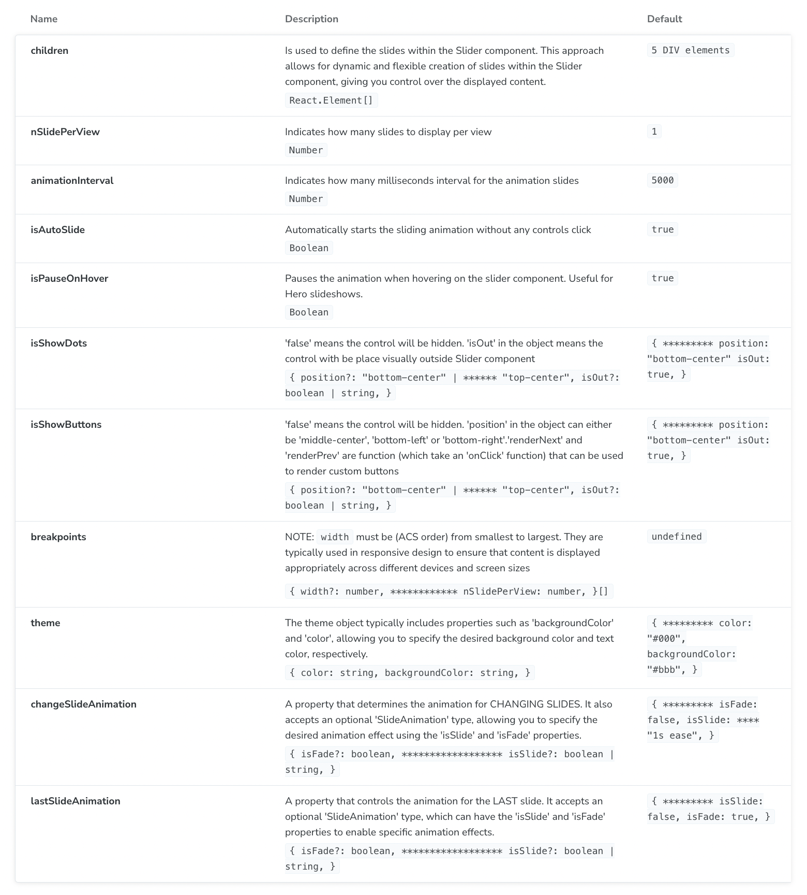

# react-rc-carousel

[](https://www.npmjs.com/package/react-rc-carousel)

#####

[](https://opensource.org/licenses/MIT)
[](https://www.typescriptlang.org/)
[](https://reactjs.org/)

A React carousel component with very easy-to-use API for creating dynamic and flexible slideshows.

[VIEW LIVE EXAMPLES](https://react-rc-carousel-examples.vercel.app)

## Table of Contents

- [Features](#features)
- [Installation](#installation)
- [Usage](#usage)
- [Props](#props)
- [Examples](#examples)
- [License](#license)

## Features

The **"react-rc-carousel"** package provides the following features:

- **_Dynamic Slide Creation_**: The **_Slider_** component allows for dynamic and flexible creation of slides within the carousel. You have full control over the content displayed in each slide.

- **_Customizable Slide Display_**: You can specify the number of slides to display per view using the `nSlidePerView` prop. This gives you the flexibility to adjust the carousel layout based on your needs.

- **_Slide Animation_**: The package supports slide animation effects. You can enable sliding animation between slides and fading animation for the last slide using the `lastSlideAnimation` prop and `changeSlideAnimation` prop, respectively.

- **_Slide Interval_**: The component supports slide animation between slides. You can control the animation interval using the `animationInterval` prop.

- **_Automatic Slideshow_**: The `isAutoSlide` prop allows you to automatically start the sliding animation without any control click. This is useful for creating automated slideshows or hero banners.

- **_Pause on Hover_**: The `isPauseOnHover` prop enables the option to pause the animation when hovering over the carousel. This is particularly useful for interactive slideshows or when you want to provide more control to the users.

- **_Control Dots_**: The package provides control dots that indicate the current active slide. You can customize the visibility and position of these dots using the `isShowDots` prop. Choose to hide the dots or visually place them outside the carousel if desired.

- **_Control Buttons_**: The `isShowButtons` prop controls the visibility, position, and appearance of control buttons for navigating between slides. You can customize the position and render custom buttons if needed.

- **_Responsive Design_**: The component supports responsive design through the `breakpoints` prop. You can define different numbers of slides per view based on the screen width, ensuring optimal display on various devices.

## Installation

You can install the package using npm:

```shell
npm install react-rc-carousel
```

## Usage

```javascript
import { Slider } from "react-rc-carousel";

const MyComponent = () => {
  return (
    <Slider nSlidePerView={2} animationInterval={2000}>
      <div>Slide 1</div>
      <div>Slide 2</div>
      <div>Slide 3</div>
      <div>Slide 4</div>
    </Slider>
  );
};

export default MyComponent;
```

## Props

Props

The **_Slider_** component accepts the following props:



- **children**:

  - **_Description_**: `NOTE: each child element (slide) should NOT have a 'width' CSS as the Slider controls the 'width' for you.` Is used to define the slides within the Slider component. This approach allows for dynamic and flexible creation of slides within the Slider component, giving you control over the displayed content.
  - **_Type_**: `React.Element[]`
  - **_Default Value_**: `5 DIV elements`

- **nSlidePerView**:

  - **_Description_**: `NOTE: this controls the 'width' of each child element (slide)` Indicates how many slides to display per view.
  - **_Type_**: `Number`
  - **_Default Value_**: `1`

- **animationInterval**:

  - **_Description_**: Indicates the interval in milliseconds for the animation slides.
  - **_Type_**: `Number`
  - **_Default Value_**: `5000`

- **isPauseOnHover**:

  - **_Description_**: Pauses the animation when hovering on the slider component. Useful for Hero slideshows.
  - **_Type_**: `Boolean`
  - **_Default Value_**: `true`

- **isAutoSlide**:

  - **_Description_**: Automatically starts the sliding animation without any controls click.
  - **_Type_**: `Boolean`
  - **_Default Value_**: `true`

- **isShowDots**:

  - **_Description_**: 'false' means the control will be hidden. 'isOut' in the object means the control will be visually placed outside the Slider component.
  - **_Type_**: `{ position?: 'bottom-center' | 'top-center', isOut?: boolean | string }`
  - **_Default Value_**: `{ position: 'bottom-center', isOut: true }`

- **isShowButtons**:

  - **_Description_**: 'false' means the control will be hidden. 'position' in the object can either be 'middle-center', 'bottom-left', or 'bottom-right'. 'renderNext' and 'renderPrev' are functions (which take an 'onClick' function) that can be used to render custom buttons.
  - **_Type_**: `{ position?: 'bottom-center' | 'top-center', isOut?: boolean | string }`
  - **_Default Value_**: `{ position: 'bottom-center', isOut: true }`

- **theme**:

  - **_Description_**: The theme object typically includes properties such as 'backgroundColor' and 'color', allowing you to specify the desired background color and text color, respectively.
  - **_Type_**: `{ color: string, backgroundColor: string }`
  - **_Default Value_**: `{ color: '#000', backgroundColor: '#bbb' }`

- **breakpoints**:

  - **_Description_**: `NOTE: 'width' must be in ascending order from smallest to largest.` They are typically used in responsive design to ensure that content is displayed appropriately across different devices and screen sizes.
  - **_Type_**: `{ width?: number, nSlidePerView: number }[]`
  - **_Default Value_**: `undefined`

- **lastSlideAnimation**:

  - **_Description_**: A property that controls the animation for the LAST slide. It accepts an optional 'SlideAnimation' type, which can have the 'isSlide' and 'isFade' properties to enable specific animation effects.
  - **_Type_**: `{ isFade?: boolean, isSlide?: boolean | string }`
  - **_Default Value_**: `{ isSlide: false, isFade: true }`

- **changeSlideAnimation**:

  - **_Description_**: A property that determines the animation for CHANGING SLIDES. It also accepts an optional 'SlideAnimation' type, allowing you to specify the desired animation effect using the 'isSlide' and 'isFade' properties.
  - **_Type_**: `{ isFade?: boolean, isSlide?: boolean | string }`
  - **_Default Value_**: `{ isFade: false, isSlide: '1s ease' }`

## Examples

#### Primary Usage

```javascript
import { Slider } from "react-rc-carousel";

const Example = () => {
  return (
    <Slider>
      <div>Slide 1</div>
      <div>Slide 2</div>
      <div>Slide 3</div>
    </Slider>
  );
};

export default Example;
```

#### Advance Usage

```javascript
import { Slider } from "react-rc-carousel";

const Example = () => {
  return (
    <Slider
      nSlidePerView={3}
      animationInterval={3000}
      isPauseOnHover={true}
      isAutoSlide={true}
      isShowDots={{
        position: "bottom-center",
        isOut: true,
      }}
      isShowButtons={{
        position: "bottom-left",
        isOut: false,
        renderNext: (onClick) => <button onClick={onClick}>Next</button>,
        renderPrev: (onClick) => <button onClick={onClick}>Previous</button>,
      }}
      theme={{
        color: "#222",
        backgroundColor: "#aaa",
      }}
      breakpoints={[
        { width: 500, nSlidePerView: 1 },
        { width: 900, nSlidePerView: 2 },
        { width: 1200, nSlidePerView: 3 },
      ]}
      lastSlideAnimation={{
        isFade: true,
        isSlide: false,
      }}
      changeSlideAnimation={{
        isFade: false,
        isSlide: "1s ease",
      }}
    >
      <div>Slide 1</div>
      <div>Slide 2</div>
      <div>Slide 3</div>
      <div>Slide 4</div>
    </Slider>
  );
};

export default Example;
```

#### Structural Usage

```javascript
import { SliderThemeProvider, Slider } from "react-rc-carousel";

const Example = () => {
  return (
    <>
      <SliderThemeProvider
       props={{
          nSlidePerView: 2,
          animationInterval: 3000,
          isPauseOnHover: true,
          isAutoSlide: true,
          isShowDots: {
            position: "bottom-center",
            isOut: true,
          }
        }}
        {/* Add as many props as you like */}
      >
        <Slider>
          <div>Slide 1</div>
          <div>Slide 2</div>
          <div>Slide 3</div>
        </Slider>
      </SliderThemeProvider>

      <SliderThemeProvider
       props={{
          isShowDots: {
            position: "top-center",
            isOut: false,
          }
          theme: {
            backgroundColor: "red",
            color: "yellow",
          }
        }}
        {/* Add as many props as you like */}
      >
        <Slider theme={{
            backgroundColor: "#aaa",
            color: "#222",
          }}>
          <div>Slide 1</div>
          <div>Slide 2</div>
          <div>Slide 3</div>
        </Slider>

        <Slider>
          <div>Slide 1</div>
          <div>Slide 2</div>
        </Slider>

        <Slider>
          <div>Slide 1</div>
          <div>Slide 2</div>
        </Slider>
      </SliderThemeProvider>
    </>
  );
};

export default Example;
```

## License

This project is licensed under the [MIT License](https://opensource.org/licenses/MIT).
